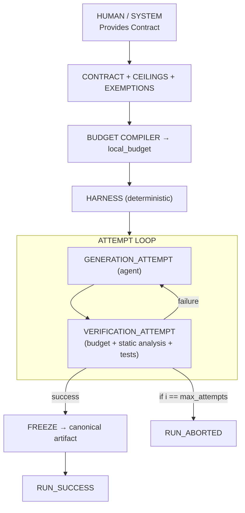

<div align="center">

<pre style="font-weight: bold;">
<span style="color: #ff5555">    ___ </span><span style="color: #ffb86c">  ______</span><span style="color: #f1fa8c">________</span><span style="color: #50fa7b">___   __</span><span style="color: #8be9fd">________</span><span style="color: #bd93f9">________ </span>
<span style="color: #ff5555">   /   |</span><span style="color: #ffb86c"> / ____/</span><span style="color: #f1fa8c"> ____/ |</span><span style="color: #50fa7b"> \ | / /</span><span style="color: #8be9fd">_  __/  </span><span style="color: #bd93f9">_/ ____/ </span>
<span style="color: #ff5555">  / /| |</span><span style="color: #ffb86c">/ / __/ </span><span style="color: #f1fa8c">__/ /  |</span><span style="color: #50fa7b">\| |/ / </span><span style="color: #8be9fd">/ /  / /</span><span style="color: #bd93f9">/ /      </span>
<span style="color: #ff5555"> / ___ /</span><span style="color: #ffb86c"> /_/ / /</span><span style="color: #f1fa8c">___/ /| </span><span style="color: #50fa7b"> /|  / /</span><span style="color: #8be9fd"> / _/ //</span><span style="color: #bd93f9"> /___    </span>
<span style="color: #ff5555">/_/  |_\</span><span style="color: #ffb86c">____/___</span><span style="color: #f1fa8c">__/_/ |_</span><span style="color: #50fa7b">/ |_/ /_</span><span style="color: #8be9fd">/ /___/\</span><span style="color: #bd93f9">____/    </span>
                                                 
<span style="color: #ff5555">    __  </span><span style="color: #ffb86c">_____   </span><span style="color: #f1fa8c"> ____  _</span><span style="color: #50fa7b">   _____</span><span style="color: #8be9fd">________</span><span style="color: #bd93f9">_______  </span>
<span style="color: #ff5555">   / / /</span><span style="color: #ffb86c"> /   |  </span><span style="color: #f1fa8c">/ __ \/ </span><span style="color: #50fa7b">| / / __</span><span style="color: #8be9fd">__/ ___/</span><span style="color: #bd93f9"> ___/ /  </span>
<span style="color: #ff5555">  / /_/ </span><span style="color: #ffb86c">/ /| | /</span><span style="color: #f1fa8c"> /_/ /  </span><span style="color: #50fa7b">|/ / __/</span><span style="color: #8be9fd">  \__ \\</span><span style="color: #bd93f9">__ \_/   </span>
<span style="color: #ff5555"> / __  /</span><span style="color: #ffb86c"> ___ |/ </span><span style="color: #f1fa8c">_, _/ /|</span><span style="color: #50fa7b">  / /___</span><span style="color: #8be9fd"> ___/ /_</span><span style="color: #bd93f9">_/ /_    </span>
<span style="color: #ff5555">/_/ /_/_</span><span style="color: #ffb86c">/  |_/_/</span><span style="color: #f1fa8c"> |_/_/ |</span><span style="color: #50fa7b">_/_____/</span><span style="color: #8be9fd">/____/__</span><span style="color: #bd93f9">__(_)    </span>
</pre>


</div>

---

### **Meet Agentic Generation Harness: Guardrails for Your AI Developer**

Generating software with AI is incredibly powerful, but it can also be wildly unpredictable. If you’re building real products, you need your AI tools to behave like reliable professionals—not improvisational jazz musicians.

Welcome to the **Agentic Generation Harness (V1)**. 

Think of this app as the ultimate Project Manager for your AI. It lets you harness the creative, problem-solving power of Artificial Intelligence, while wrapping it in strict rules, safety checks, and absolute transparency. 

If you care about getting **predictable results, controlling costs, and knowing exactly how your code was built**, you are in the right place.

---

### **How It Works (Without the Jargon)**

We let the AI do what it does best—generate ideas and write code—while the Harness acts as an "operating system" to keep everything safe and sound. 

* **You Set the Rules (The Contract):** Tell the app exactly what you want to build. The AI must follow these instructions perfectly.
* **No Scope Creep (The Budget):** Set strict limits on what the AI is allowed to do and how much processing power it can use.
* **Strict Quality Control (The Checker):** Before anything is finalized, the Harness automatically inspects the AI's work to ensure it is safe, secure, and structurally sound. 
* **Total Transparency (The Ledger):** We record every single step the AI takes. You get a completely transparent "receipt" of every decision made, making it easy to audit, review, or reproduce the work later.

### **The Result?**
No guesswork. No messy code. Just high-quality, AI-generated software you can actually trust, reproduce, and ship with confidence.

---

## What This Project Is *Not*

* It’s not a framework for writing prompts.
* It’s not a model.
* It’s not a magic wand.
* It’s not a replacement for engineering judgment.

It’s the **infrastructure** that makes agentic coding safe, predictable, and reviewable.

---

## Repository Layout

The repository is organized around clear subsystem boundaries:

```text
/
├── contract/               # Contract schema + validator
├── ceilings/               # Global ceilings (structural limits)
├── exemptions/             # Narrow, controlled override system
├── budget_compiler/        # Deterministic budget derivation
├── static_analysis/        # Structural metrics + normalization
├── harness/                # Deterministic state machine
├── generator_interface/    # Request/response boundary for generators
├── ledger/                 # Canonical event log
├── agent/                  # Planner + generator adapters
└── docs/                   # Full specifications (the real meat)
```

Each subsystem has its own spec in `docs/`.
Those documents are the authoritative source of truth.

---

## How It Works (High-Level)

1. **You provide a contract.**
   It describes the artifact you want and the structural boundaries it must obey.
2. **The Budget Compiler derives limits.**
   These limits are deterministic and enforceable.
3. **The agent generates a candidate artifact.**
   This can be an LLM, a multi-agent system, or any generator you plug in.
4. **The Harness validates the artifact.**
   Static analysis, tests, and freeze hashing — all deterministic.
5. **If it fails, the agent tries again.**
   Attempts are bounded and fully logged.
6. **If it passes, the artifact is frozen.**
   You get a reproducible output with a canonical hash.

Everything is recorded in the **Ledger**, so you can replay, audit, or debug any run.



---


## Quickstart (Current Local Runner)

```bash
make
./harness_cli init
./harness_cli run \
  --contract samples/contract.json \
  --ceilings samples/ceilings.json \
  --exemptions samples/exemptions.json \
  --artifact core/ledger/ledger.c
```

This writes `toolchain_manifest.json` and a deterministic `run_ledger.jsonl` for local execution.

---

## Who This Is For

* Engineers building agentic coding systems
* Teams who want reproducible AI-generated code
* Researchers exploring deterministic AI workflows
* Anyone tired of “it worked yesterday” energy

If you want AI to behave like a reliable subsystem instead of a creative intern, this project is for you.

---

## License

This project is released under the **MIT License**.
Do whatever you want — just don’t blame us if you summon Skynet.

---

## Security

If you discover a security issue, please contact:

**agent@horoji.org**

We take security seriously and will respond promptly.

---

## Contributing

At this time, we are **not accepting external contributions**.
The specification is still stabilizing, and we want to maintain strict coherence across subsystems.

---

## Getting Started

The best way to begin is to read the specs in `docs/`.
They’re written to be clear, explicit, and mechanically enforceable.

Start with:
* `ARCHITECTURE_DOCUMENT.md`
* `RUN_MODEL.md`
* `HARNESS.md`

Then explore the subsystem specs as needed.

---

## Final Note

This project is built on a simple belief:

**AI can generate code — but only disciplined systems can ship it.**

Welcome aboard.
