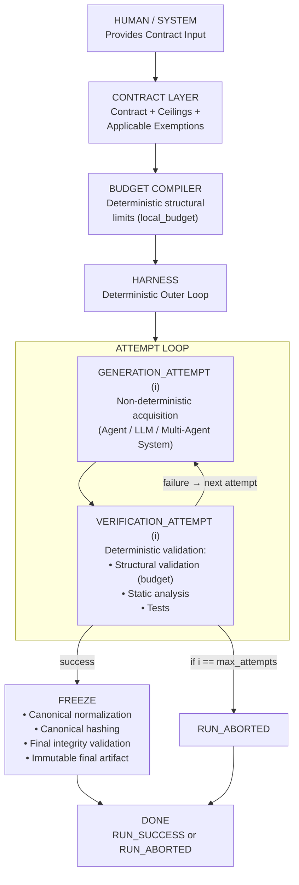
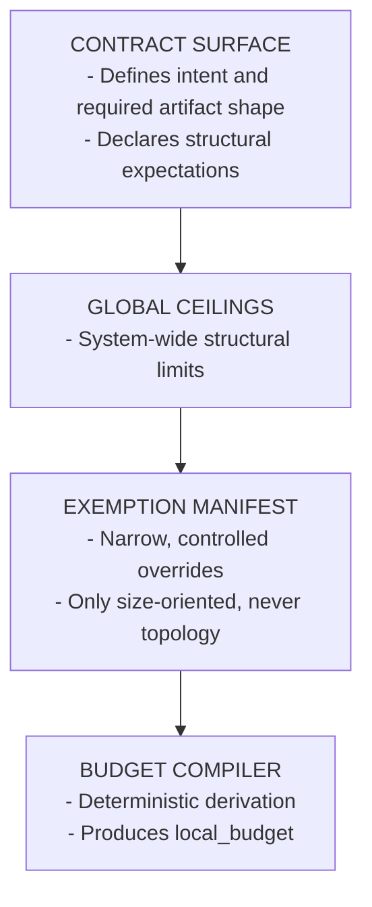
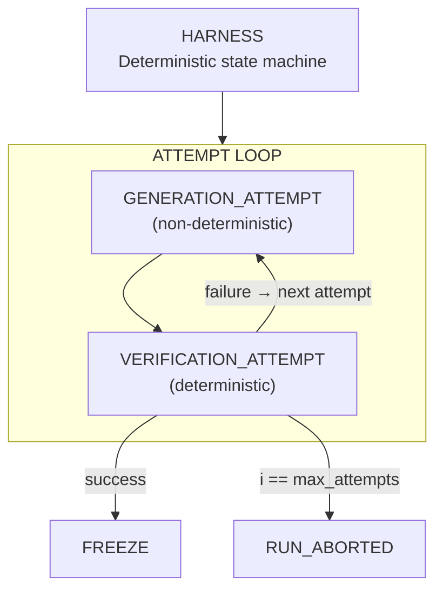
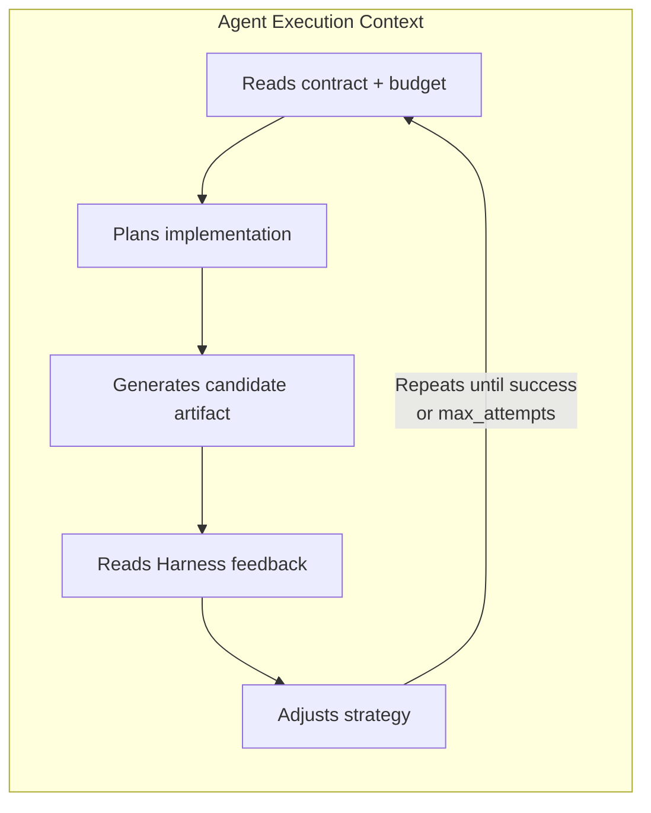
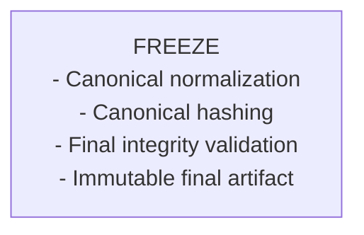
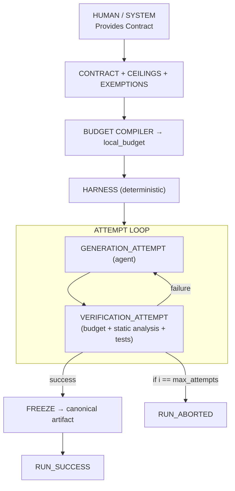

# Agentic Generation Harness — Diagram Overview (Final V1)

A visual, intuitive map of the entire system — now aligned with the final `RUN_MODEL`, normalization spec, and trust boundaries.

---

## 1. TOP-LEVEL SYSTEM FLOW

---

## 2. SUBSYSTEM RELATIONSHIPS

---

## 3. HARNESS: THE DETERMINISTIC OUTER LOOP

---

## 4. AGENT: THE NON-DETERMINISTIC INNER LOOP

The agent (LLM or multi-agent system):

The agent can be creative.
The Harness cannot.

---

## 5. LEDGER: PASSIVE, APPEND-ONLY AUDIT TRAIL

The Harness emits events.
The Ledger stores them.
The Ledger never drives control flow.

**Recorded events include:**
* `CONTRACT_ACCEPTED`
* `BUDGET_DERIVED`
* `EXEMPTION_APPLIED`
* `GENERATION_ATTEMPTED(i)`
* `GENERATION_FAILED(i)`
* `GENERATION_SUCCEEDED(i)`
* `STATIC_ANALYSIS_PASSED(i)`
* `STATIC_ANALYSIS_FAILED(i)`
* `TESTS_PASSED(i)`
* `TESTS_FAILED(i)`
* `ATTEMPT_FAILED(i)`
* `ATTEMPT_PASSED(i)`
* `FREEZE_FAILED`
* `ARTIFACT_FROZEN`
* `RUN_SUCCESS` or `RUN_ABORTED`

---

## 6. FREEZE: THE FINAL TRUST BOUNDARY

When an attempt passes verification:

Freeze is not formatting.
Freeze is the final integrity checkpoint.

---

## 7. COMPLETE SYSTEM IN ONE DIAGRAM

---

## 8. WHAT THIS SYSTEM GUARANTEES

* ✔ Deterministic validation
* ✔ Bounded complexity
* ✔ Reproducible artifacts
* ✔ Full audit trail
* ✔ Explicit trust boundaries
* ✔ A safe outer loop around creative AI systems

This is how agentic coding becomes **reliable engineering**.
